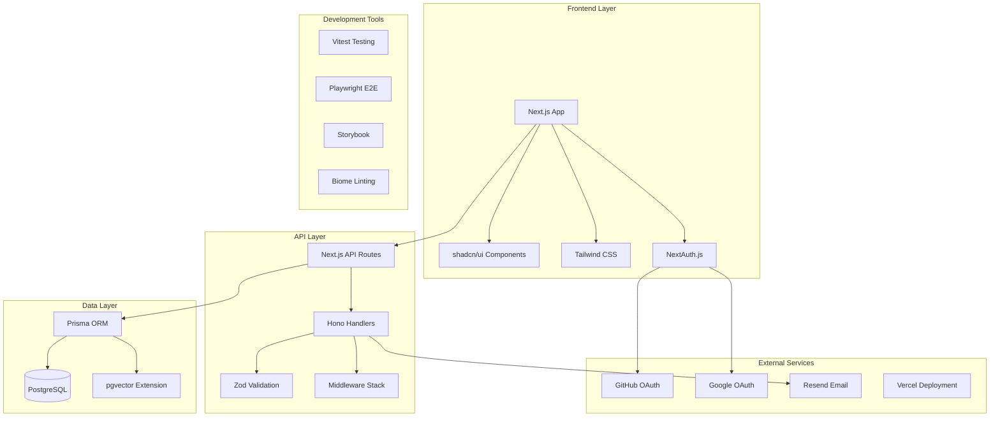
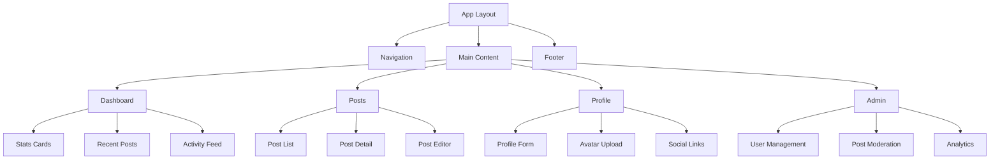
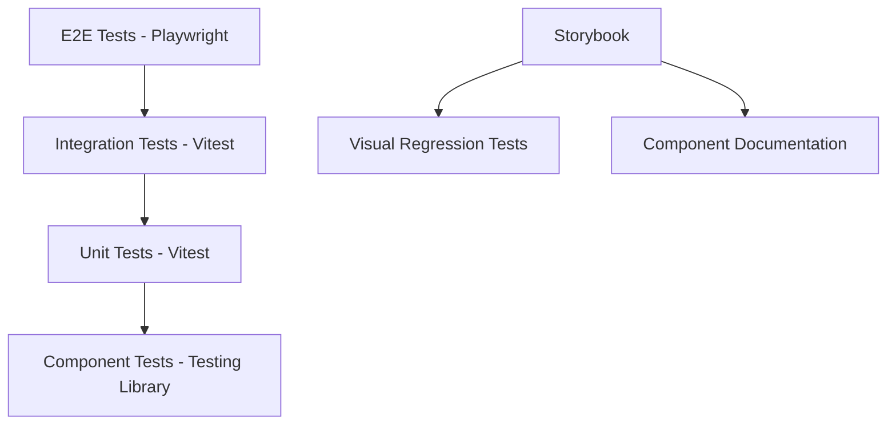
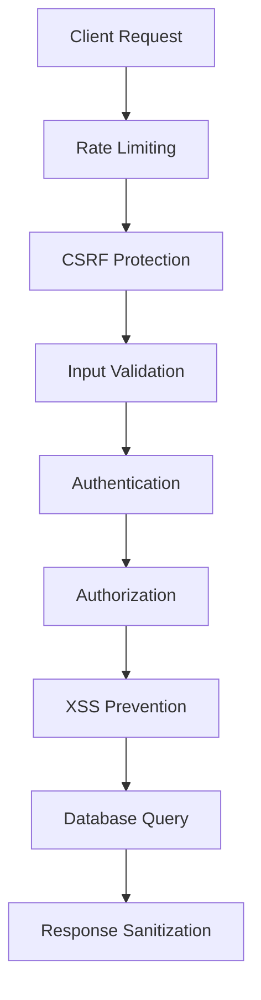

# Design Document

## Overview

エンジニア転職活動において「実務即戦力」を証明するためのフルスタックWebアプリケーションを構築します。Next.js + Honoを使用したモノレポ構成で、認証・投稿管理・国際化を含む包括的なポートフォリオアプリケーションを開発し、技術力・設計力・運用力を総合的にアピールします。  
さらに、GPT‑4o / GitHub Copilot を活用した **AI 駆動開発 (AI‑Driven Development)** ― コード生成・テスト生成・ドキュメント自動化、ならびに voice / video coding ワークフロー ― を導入し、生産性と品質向上を定量的に示すことを目的とします。

### 技術選定理由

- **Next.js 15**: App Routerによる最新のReact開発体験、SSR/SSG対応、優れたパフォーマンス、PWA対応
- **Hono**: 軽量で高速なWeb API フレームワーク、Edge Runtime対応、優れたミドルウェアサポート
- **Prisma**: 型安全なORM、優れた開発者体験、マイグレーション管理
- **PostgreSQL**: 堅牢なリレーショナルデータベース、pgvector拡張による全文検索・ベクトル検索
- **Turborepo**: 効率的なモノレポ管理、インクリメンタルビルド、並列実行
- **Biome**: 高速なリンター・フォーマッター、ESLint/Prettier代替
- **pnpm**: 効率的なパッケージ管理、ディスク容量節約、モノレポ対応
- **Resend**: 信頼性の高いメール配信サービス、開発者フレンドリーなAPI
- **Vercel**: Next.js最適化されたホスティング、自動デプロイ、プレビュー環境

## Architecture

### システム全体構成



### モノレポ構造

```
monorepo/
├── apps/
│   ├── web/                  # Next.js frontend application
│   │   ├── app/              # App Router pages
│   │   ├── components/       # React components
│   │   ├── lib/              # Utility functions
│   │   └── public/           # Static assets
│   └── api/                  # Hono API application
│       ├── src/
│       │   ├── routes/       # API route handlers
│       │   ├── middleware/   # Custom middleware
│       │   ├── services/     # Business logic
│       │   └── utils/        # Utility functions
│       └── tests/            # API tests
├── packages/
│   ├── ui/                   # Shared UI components (shadcn/ui)
│   ├── database/             # Prisma schema and migrations
│   ├── auth/                 # Authentication utilities
│   ├── config/               # Shared configurations
│   └── types/                # Shared TypeScript types
├── .devcontainer/            # Development container setup
├── .github/                  # CI/CD workflows
└── docs/                     # Documentation
    ├── adr/                  # Architecture Decision Records
    └── api/                  # API documentation
```

## Components and Interfaces

### Frontend Components Architecture



### API Interface Design

#### Authentication Endpoints

```typescript
// /api/auth/*
interface AuthRoutes {
  'POST /api/auth/signin': {
    body: { provider: 'github' | 'google' }
    response: { url: string }
  }
  'POST /api/auth/signout': {
    response: { success: boolean }
  }
  'GET /api/auth/session': {
    response: { user: User | null }
  }
}
```

#### User Management Endpoints

```typescript
// /api/users/*
interface UserRoutes {
  'GET /api/users/profile': {
    response: { user: UserProfile }
  }
  'PUT /api/users/profile': {
    body: UpdateUserProfileRequest
    response: { user: UserProfile }
  }
  'POST /api/users/avatar': {
    body: FormData
    response: { avatarUrl: string }
  }
  'POST /api/users/reset-password': {
    body: { email: string }
    response: { success: boolean }
  }
  'POST /api/users/verify-email': {
    body: { token: string }
    response: { success: boolean }
  }
}
```

#### Posts Management Endpoints

```typescript
// /api/posts/*
interface PostRoutes {
  'GET /api/posts': {
    query: { page?: number; limit?: number; search?: string; tags?: string[] }
    response: { posts: Post[]; total: number; hasMore: boolean }
  }
  'POST /api/posts': {
    body: CreatePostRequest
    response: { post: Post }
  }
  'PUT /api/posts/:id': {
    params: { id: string }
    body: UpdatePostRequest
    response: { post: Post }
  }
  'DELETE /api/posts/:id': {
    params: { id: string }
    response: { success: boolean }
  }
  'GET /api/posts/search': {
    query: { q: string; limit?: number }
    response: { posts: Post[]; total: number }
  }
}
```

#### Notification Endpoints

```typescript
// /api/notifications/*
interface NotificationRoutes {
  'GET /api/notifications': {
    response: { notifications: Notification[] }
  }
  'POST /api/notifications/send': {
    body: { type: 'email' | 'toast'; message: string; userId?: string }
    response: { success: boolean }
  }
  'PUT /api/notifications/:id/read': {
    params: { id: string }
    response: { success: boolean }
  }
}
```

#### Admin Management Endpoints

```typescript
// /api/admin/*
interface AdminRoutes {
  'GET /api/admin/users': {
    query: { page?: number; limit?: number; search?: string }
    response: { users: User[]; total: number }
  }
  'PUT /api/admin/users/:id/role': {
    params: { id: string }
    body: { role: 'USER' | 'ADMIN' }
    response: { user: User }
  }
  'GET /api/admin/posts': {
    query: { page?: number; limit?: number; status?: 'published' | 'draft' }
    response: { posts: Post[]; total: number }
  }
  'PUT /api/admin/posts/:id/moderate': {
    params: { id: string }
    body: { action: 'approve' | 'reject'; reason?: string }
    response: { success: boolean }
  }
  'GET /api/admin/analytics': {
    response: { stats: AdminStats }
  }
}
```

### Middleware Stack

```typescript
// Hono middleware chain
app.use('*', cors())
app.use('*', logger())
app.use('*', rateLimiter())
app.use('/api/admin/*', adminAuth())
app.use('/api/protected/*', userAuth())
app.use('*', errorHandler())
```

## Data Models

### Database Schema

```prisma
// User model
model User {
  id            String    @id @default(cuid())
  email         String    @unique
  name          String?
  image         String?
  bio           String?
  githubUrl     String?
  twitterUrl    String?
  linkedinUrl   String?
  role          Role      @default(USER)
  emailVerified DateTime?
  createdAt     DateTime  @default(now())
  updatedAt     DateTime  @updatedAt
  
  accounts      Account[]
  sessions      Session[]
  posts         Post[]
  
  @@map("users")
}

// Post model
model Post {
  id          String   @id @default(cuid())
  title       String
  content     String
  excerpt     String?
  published   Boolean  @default(false)
  slug        String   @unique
  coverImage  String?
  createdAt   DateTime @default(now())
  updatedAt   DateTime @updatedAt
  
  authorId    String
  author      User     @relation(fields: [authorId], references: [id], onDelete: Cascade)
  tags        Tag[]
  
  // Full-text search vector
  searchVector Unsupported("tsvector")?
  
  @@map("posts")
}

// Tag model
model Tag {
  id    String @id @default(cuid())
  name  String @unique
  slug  String @unique
  color String @default("#3B82F6")
  
  posts Post[]
  
  @@map("tags")
}

// NextAuth.js required models
model Account {
  id                String  @id @default(cuid())
  userId            String
  type              String
  provider          String
  providerAccountId String
  refresh_token     String? @db.Text
  access_token      String? @db.Text
  expires_at        Int?
  token_type        String?
  scope             String?
  id_token          String? @db.Text
  session_state     String?
  
  user User @relation(fields: [userId], references: [id], onDelete: Cascade)
  
  @@unique([provider, providerAccountId])
  @@map("accounts")
}

model Session {
  id           String   @id @default(cuid())
  sessionToken String   @unique
  userId       String
  expires      DateTime
  
  user User @relation(fields: [userId], references: [id], onDelete: Cascade)
  
  @@map("sessions")
}

enum Role {
  USER
  ADMIN
}
```

### Data Validation Schemas

```typescript
// Zod schemas for API validation
export const CreatePostSchema = z.object({
  title: z.string().min(1).max(200),
  content: z.string().min(1),
  excerpt: z.string().max(300).optional(),
  published: z.boolean().default(false),
  tags: z.array(z.string()).max(10),
  coverImage: z.string().url().optional()
})

export const UpdateUserProfileSchema = z.object({
  name: z.string().min(1).max(100).optional(),
  bio: z.string().max(500).optional(),
  githubUrl: z.string().url().optional(),
  twitterUrl: z.string().url().optional(),
  linkedinUrl: z.string().url().optional()
})
```

## Error Handling

### Error Response Format

```typescript
interface ApiError {
  error: {
    code: string
    message: string
    details?: Record<string, unknown>
    traceId: string
    timestamp: string
  }
}
```

### Error Handling Strategy

1. **Client-side Error Boundaries**: React Error Boundaryでコンポーネントレベルのエラーをキャッチ
2. **API Error Middleware**: Honoミドルウェアで統一的なエラーレスポンス
3. **Validation Errors**: Zodスキーマによる入力値検証とエラーメッセージ
4. **Database Errors**: Prismaエラーの適切なハンドリングとログ出力
5. **Authentication Errors**: NextAuth.jsエラーの処理とリダイレクト

```typescript
// Error handling middleware
export const errorHandler = (): MiddlewareHandler => {
  return async (c, next) => {
    try {
      await next()
    } catch (error) {
      const traceId = c.get('traceId') || generateTraceId()
      
      if (error instanceof ZodError) {
        return c.json({
          error: {
            code: 'VALIDATION_ERROR',
            message: 'Invalid input data',
            details: error.errors,
            traceId,
            timestamp: new Date().toISOString()
          }
        }, 400)
      }
      
      if (error instanceof PrismaClientKnownRequestError) {
        return c.json({
          error: {
            code: 'DATABASE_ERROR',
            message: 'Database operation failed',
            traceId,
            timestamp: new Date().toISOString()
          }
        }, 500)
      }
      
      // Log unexpected errors
      console.error('Unexpected error:', error, { traceId })
      
      return c.json({
        error: {
          code: 'INTERNAL_ERROR',
          message: 'An unexpected error occurred',
          traceId,
          timestamp: new Date().toISOString()
        }
      }, 500)
    }
  }
}
```

## Testing Strategy

### テストピラミッド構成



### テスト分類と責任範囲

1. **Unit Tests (Vitest)**
   - ユーティリティ関数
   - ビジネスロジック
   - データ変換処理
   - バリデーション関数

2. **Component Tests (Testing Library + Vitest)**
   - React コンポーネントの動作
   - ユーザーインタラクション
   - プロパティの受け渡し
   - 条件付きレンダリング

3. **Integration Tests (Vitest)**
   - API エンドポイント
   - データベース操作
   - 認証フロー
   - ミドルウェア動作

4. **E2E Tests (Playwright)**
   - ユーザージャーニー
   - 認証フロー
   - 投稿作成・編集・削除
   - 管理者機能

5. **Visual Tests (Storybook)**
   - コンポーネントの見た目
   - レスポンシブデザイン
   - テーマ切り替え
   - 状態変化

### テスト設定例

```typescript
// vitest.config.ts
export default defineConfig({
  test: {
    environment: 'jsdom',
    setupFiles: ['./tests/setup.ts'],
    coverage: {
      provider: 'v8',
      reporter: ['text', 'json', 'html'],
      thresholds: {
        global: {
          branches: 80,
          functions: 80,
          lines: 80,
          statements: 80
        }
      }
    }
  }
})

// playwright.config.ts
export default defineConfig({
  testDir: './e2e',
  fullyParallel: true,
  forbidOnly: !!process.env.CI,
  retries: process.env.CI ? 2 : 0,
  workers: process.env.CI ? 1 : undefined,
  reporter: 'html',
  use: {
    baseURL: 'http://localhost:3000',
    trace: 'on-first-retry',
  },
  projects: [
    {
      name: 'chromium',
      use: { ...devices['Desktop Chrome'] },
    },
    {
      name: 'firefox',
      use: { ...devices['Desktop Firefox'] },
    },
    {
      name: 'webkit',
      use: { ...devices['Desktop Safari'] },
    },
  ],
})
```

### パフォーマンステスト

```typescript
// Performance budget configuration
export const performanceBudget = {
  lighthouse: {
    performance: 90,
    accessibility: 90,
    bestPractices: 90,
    seo: 90
  },
  webVitals: {
    lcp: 2500, // Largest Contentful Paint
    fid: 100,  // First Input Delay
    cls: 0.1   // Cumulative Layout Shift
  }
}
```

## 国際化 (i18n) アーキテクチャ

### 言語サポート設計

```typescript
// next-i18next configuration
export const i18nConfig = {
  locales: ['ja', 'en'],
  defaultLocale: 'ja',
  localeDetection: true,
  fallbackLng: 'ja',
  interpolation: {
    escapeValue: false
  }
}

// Language switching component
interface LanguageSwitcherProps {
  currentLocale: string
  onLocaleChange: (locale: string) => void
}
```

**設計決定**: next-i18nextを採用する理由は、Next.js App Routerとの統合が優れており、SSR/SSGでの多言語対応が効率的に実現できるため。ブラウザ言語検出とセッション永続化により、ユーザー体験を向上させる。

## セキュリティアーキテクチャ

### セキュリティ対策の多層防御



### セキュリティミドルウェア設計

```typescript
// Security middleware stack
export const securityMiddleware = {
  rateLimit: rateLimit({
    windowMs: 15 * 60 * 1000, // 15 minutes
    max: 100, // limit each IP to 100 requests per windowMs
    message: 'Too many requests from this IP'
  }),
  
  csrf: csrf({
    cookie: {
      httpOnly: true,
      secure: process.env.NODE_ENV === 'production',
      sameSite: 'strict'
    }
  }),
  
  helmet: helmet({
    contentSecurityPolicy: {
      directives: {
        defaultSrc: ["'self'"],
        styleSrc: ["'self'", "'unsafe-inline'"],
        scriptSrc: ["'self'"],
        imgSrc: ["'self'", "data:", "https:"]
      }
    }
  })
}
```

**設計決定**: 多層防御アプローチを採用し、各レイヤーで異なるセキュリティ脅威に対処。OWASP Top 10に基づいた包括的な対策を実装する。

## パフォーマンス最適化設計

### パフォーマンス監視とメトリクス

```typescript
// Performance monitoring configuration
export const performanceConfig = {
  webVitals: {
    lcp: { target: 2500, warning: 2000 },
    fid: { target: 100, warning: 50 },
    cls: { target: 0.1, warning: 0.05 },
    ttfb: { target: 200, warning: 100 }
  },
  
  lighthouse: {
    performance: 90,
    accessibility: 90,
    bestPractices: 90,
    seo: 90
  }
}

// Database connection pooling
export const databaseConfig = {
  connectionLimit: 10,
  acquireTimeout: 60000,
  timeout: 60000,
  reconnect: true
}
```

### キャッシュ戦略

```typescript
// Multi-layer caching strategy
export const cacheStrategy = {
  // Browser cache
  staticAssets: 'public, max-age=31536000, immutable',
  
  // CDN cache
  pages: 'public, max-age=3600, s-maxage=86400',
  
  // API cache
  apiResponses: 'private, max-age=300',
  
  // Database query cache
  prismaCache: {
    ttl: 300, // 5 minutes
    max: 1000 // max items
  }
}
```

**設計決定**: 多層キャッシュ戦略により、ブラウザ・CDN・アプリケーション・データベースの各レベルでパフォーマンスを最適化。Next.js Image最適化とPrisma接続プールにより、リソース効率を向上させる。

## 観測性とモニタリング設計

### ログ・メトリクス・トレーシング統合

```typescript
// Structured logging with pino
export const loggerConfig = {
  level: process.env.LOG_LEVEL || 'info',
  transport: {
    target: 'pino-pretty',
    options: {
      colorize: true,
      translateTime: 'SYS:standard'
    }
  },
  serializers: {
    req: pino.stdSerializers.req,
    res: pino.stdSerializers.res,
    err: pino.stdSerializers.err
  }
}

// OpenTelemetry tracing
export const tracingConfig = {
  serviceName: 'fullstack-portfolio-app',
  serviceVersion: process.env.npm_package_version,
  instrumentations: [
    getNodeAutoInstrumentations(),
    new PrismaInstrumentation(),
    new HttpInstrumentation()
  ]
}

// Prometheus metrics
export const metricsConfig = {
  defaultMetrics: true,
  prefix: 'portfolio_app_',
  customMetrics: {
    httpRequestDuration: new Histogram({
      name: 'http_request_duration_seconds',
      help: 'Duration of HTTP requests in seconds',
      labelNames: ['method', 'route', 'status']
    }),
    
    databaseQueryDuration: new Histogram({
      name: 'database_query_duration_seconds',
      help: 'Duration of database queries in seconds',
      labelNames: ['operation', 'model']
    })
  }
}
```

**設計決定**: 構造化ログ、分散トレーシング、メトリクス収集を統合し、システムの可観測性を向上。pino、OpenTelemetry、Prometheusの組み合わせにより、本番環境での問題特定と性能分析を効率化する。

## アクセシビリティ設計

### WCAG 2.1 AA準拠アーキテクチャ

```typescript
// Accessibility configuration
export const a11yConfig = {
  testing: {
    axeCore: {
      rules: {
        'color-contrast': { enabled: true },
        'keyboard-navigation': { enabled: true },
        'aria-labels': { enabled: true },
        'semantic-html': { enabled: true }
      }
    }
  },
  
  components: {
    focusManagement: true,
    screenReaderSupport: true,
    keyboardNavigation: true,
    colorContrastRatio: 4.5 // AA standard
  }
}

// Semantic HTML structure
interface AccessibleComponentProps {
  'aria-label'?: string
  'aria-describedby'?: string
  role?: string
  tabIndex?: number
}
```

**設計決定**: WCAG 2.1 AA基準に準拠し、axe-coreによる自動テストとCI統合により継続的なアクセシビリティ品質を保証。セマンティックHTML、適切なARIAラベル、キーボードナビゲーション対応を設計段階から組み込む。

## CI/CD パイプライン設計

### GitHub Actions ワークフロー

```yaml
# .github/workflows/ci.yml の設計概要
name: CI/CD Pipeline
on: [push, pull_request]

jobs:
  quality-checks:
    - Biome linting and formatting
    - TypeScript type checking
    - Unit tests with Vitest (>80% coverage)
    - Component tests with Testing Library
    - E2E tests with Playwright
    - Security scanning with Trivy and CodeQL
    - Accessibility testing with axe-core
    - Performance testing with Lighthouse CI
  
  build-and-deploy:
    - Build Next.js application
    - Build Hono API
    - Deploy preview to Vercel (PR)
    - Deploy production to Vercel (main branch)
    - Database migration with Prisma
```

**設計決定**: GitHub ActionsとVercelの統合により、プルリクエスト時のプレビュー環境自動作成と本番デプロイの自動化を実現。品質ゲートとして複数のテストとスキャンを並列実行し、デプロイ前の品質保証を徹底する。

## インフラストラクチャ設計

### Infrastructure as Code

```typescript
// Terraform configuration design
export const infrastructureConfig = {
  vercel: {
    project: 'fullstack-portfolio-app',
    framework: 'nextjs',
    environmentVariables: {
      DATABASE_URL: '${var.database_url}',
      NEXTAUTH_SECRET: '${var.nextauth_secret}',
      GITHUB_CLIENT_ID: '${var.github_client_id}',
      GOOGLE_CLIENT_ID: '${var.google_client_id}',
      RESEND_API_KEY: '${var.resend_api_key}'
    }
  },
  
  database: {
    provider: 'postgresql',
    backupRetention: 14, // days
    connectionPooling: true,
    extensions: ['pgvector']
  }
}

// Docker Compose for local development
export const dockerConfig = {
  services: {
    postgres: {
      image: 'pgvector/pgvector:pg15',
      environment: {
        POSTGRES_DB: 'portfolio_dev',
        POSTGRES_USER: 'dev',
        POSTGRES_PASSWORD: 'dev'
      }
    },
    
    redis: {
      image: 'redis:7-alpine',
      ports: ['6379:6379']
    }
  }
}
```

**設計決定**: Infrastructure as Codeにより環境の再現性を保証。Terraformによる宣言的インフラ管理とDocker Composeによるローカル開発環境の統一により、開発・ステージング・本番環境の一貫性を確保する。

## AI駆動開発ワークフロー設計

### AI統合アーキテクチャ

```typescript
// AI development tools integration
export const aiWorkflowConfig = {
  codeGeneration: {
    githubCopilot: {
      enabled: true,
      suggestions: 'automatic',
      languages: ['typescript', 'javascript', 'prisma']
    },
    
    gptCli: {
      model: 'gpt-4o',
      contextWindow: 128000,
      temperature: 0.1,
      maxTokens: 4000
    }
  },
  
  automation: {
    testGeneration: {
      trigger: 'coverage_below_80',
      framework: 'vitest',
      types: ['unit', 'integration']
    },
    
    documentationGeneration: {
      trigger: 'pr_created',
      formats: ['release_notes', 'api_docs', 'adr']
    },
    
    codeReview: {
      trigger: 'pr_opened',
      checks: ['security', 'performance', 'accessibility']
    }
  },
  
  privacyGuardrails: {
    piiDetection: true,
    secretScanning: true,
    dataMinimization: true
  }
}

// Voice/Video coding workflow
export const voiceCodingConfig = {
  speechToCode: {
    provider: 'whisper-api',
    language: 'ja-JP',
    confidence: 0.8
  },
  
  videoDocumentation: {
    recording: 'automatic',
    transcription: true,
    codeHighlighting: true
  }
}
```

**設計決定**: AI駆動開発により生産性向上を定量化。GitHub Copilot、GPT-4o、音声コーディングの統合により、コード生成・テスト作成・ドキュメント自動化を実現。プライバシーガードレールにより、機密情報の漏洩を防止する。

## PWA・オフライン対応設計

### Progressive Web App アーキテクチャ

```typescript
// PWA configuration with next-pwa
export const pwaConfig = {
  dest: 'public',
  register: true,
  skipWaiting: true,
  runtimeCaching: [
    {
      urlPattern: /^https:\/\/fonts\.googleapis\.com\/.*/i,
      handler: 'CacheFirst',
      options: {
        cacheName: 'google-fonts-cache',
        expiration: {
          maxEntries: 10,
          maxAgeSeconds: 60 * 60 * 24 * 365 // 1 year
        }
      }
    },
    {
      urlPattern: /\/api\/posts/,
      handler: 'NetworkFirst',
      options: {
        cacheName: 'api-posts-cache',
        expiration: {
          maxEntries: 50,
          maxAgeSeconds: 60 * 60 * 24 // 1 day
        }
      }
    }
  ]
}

// Offline functionality
export const offlineStrategy = {
  cacheStrategy: 'NetworkFirst',
  fallbackPages: ['/offline'],
  cachedResources: ['posts', 'user-profile', 'static-assets'],
  syncOnReconnect: true
}
```

**設計決定**: PWA対応により、モバイルユーザーのオフライン体験を向上。Service Workerによるキャッシュ戦略とネットワーク復旧時の自動同期により、接続状況に関わらず一貫したユーザー体験を提供する。

## SEO・Analytics設計

### 検索エンジン最適化

```typescript
// SEO configuration
export const seoConfig = {
  metadata: {
    title: {
      template: '%s | Portfolio App',
      default: 'Fullstack Portfolio Application'
    },
    description: 'Modern fullstack portfolio showcasing engineering excellence',
    keywords: ['portfolio', 'fullstack', 'nextjs', 'typescript'],
    authors: [{ name: 'Developer Name' }],
    openGraph: {
      type: 'website',
      locale: 'ja_JP',
      alternateLocale: 'en_US',
      siteName: 'Portfolio App'
    },
    twitter: {
      card: 'summary_large_image',
      creator: '@username'
    }
  },
  
  sitemap: {
    generateRobotsTxt: true,
    siteUrl: process.env.NEXT_PUBLIC_SITE_URL,
    changefreq: 'daily',
    priority: 0.7
  }
}

// Analytics integration
export const analyticsConfig = {
  vercelAnalytics: {
    enabled: true,
    debug: process.env.NODE_ENV === 'development'
  },
  
  plausible: {
    domain: process.env.NEXT_PUBLIC_SITE_URL,
    trackLocalhost: false,
    enabled: process.env.NODE_ENV === 'production'
  }
}
```

**設計決定**: 動的OGP生成とサイトマップ自動更新により、検索エンジンでの発見性を向上。プライバシー重視のPlausible Analyticsにより、ユーザー追跡を最小限に抑えながら必要な分析データを収集する。

## データ管理・バックアップ設計

### データベース運用戦略

```typescript
// Database management configuration
export const databaseManagement = {
  migrations: {
    strategy: 'prisma-migrate',
    environments: ['development', 'staging', 'production'],
    rollbackStrategy: 'manual-verification',
    testingRequired: true
  },
  
  backups: {
    frequency: 'daily',
    retention: 14, // days
    storage: 'encrypted-cloud-storage',
    verification: 'weekly',
    restoreTesting: 'quarterly'
  },
  
  monitoring: {
    connectionPool: true,
    queryPerformance: true,
    diskUsage: true,
    replicationLag: true
  }
}

// Data privacy and compliance
export const dataPrivacyConfig = {
  gdprCompliance: {
    cookieConsent: true,
    dataRetention: 365, // days
    rightToErasure: true,
    dataPortability: true
  },
  
  dataMinimization: {
    collectOnlyNecessary: true,
    anonymizeAnalytics: true,
    encryptSensitiveData: true
  }
}
```

**設計決定**: 自動バックアップと定期的なリストア検証により、データ損失リスクを最小化。GDPR準拠とプライバシー��護を設計段階から組み込み、ユーザーの信頼を確保する。

この設計書は、要件定義で定義された全ての機能要件と非機能要件を満たすための包括的な技術設計を提供しています。モノレポ構成、API設計、データモデル、エラーハンドリング、テスト戦略、セキュリティ、パフォーマンス、観測性、アクセシビリティ、CI/CD、インフラ、AI駆動開発、PWA、SEO、データ管理まで、実装に必要な全ての設計決定を含んでいます。
