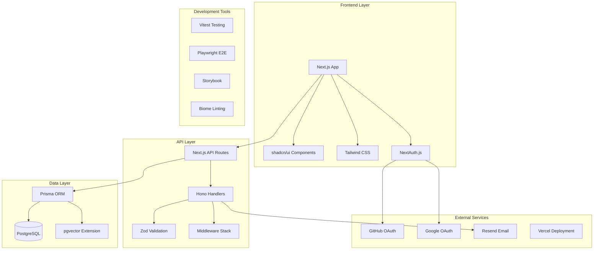
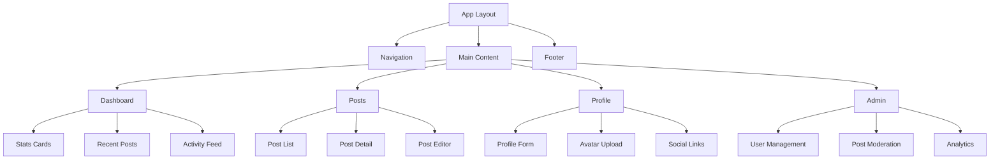
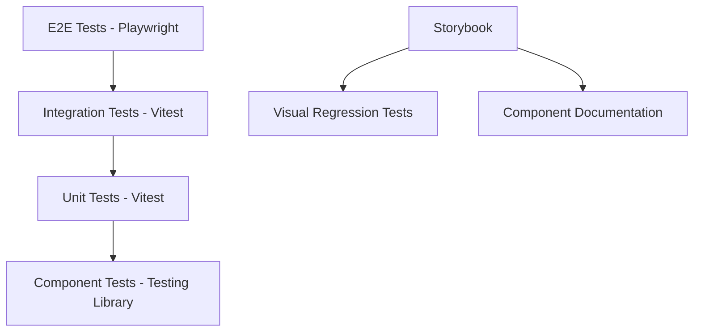

# Design Document

## Overview

フルスタックポートフォリオアプリケーションは、Next.js 14 (App Router) + Hono + Prisma + PostgreSQLを使用したモノレポ構成のWebアプリケーションです。エンジニア転職活動において実務即戦力を証明するため、認証・投稿管理・国際化・管理ダッシュボードを含む包括的な機能を提供します。

### 技術選定理由

- **Next.js 15**: App Routerによる最新のReact開発体験、SSR/SSG対応、優れたパフォーマンス
- **Hono**: 軽量で高速なWeb API フレームワーク、Edge Runtime対応
- **Prisma**: 型安全なORM、優れた開発者体験
- **PostgreSQL**: 堅牢なリレーショナルデータベース、pgvector拡張による全文検索
- **Turborepo**: 効率的なモノレポ管理、インクリメンタルビルド

## Architecture

### システム全体構成



### モノレポ構造

```
monorepo/
├── apps/
│   ├── web/                  # Next.js frontend application
│   │   ├── app/              # App Router pages
│   │   ├── components/       # React components
│   │   ├── lib/              # Utility functions
│   │   └── public/           # Static assets
│   └── api/                  # Hono API application
│       ├── src/
│       │   ├── routes/       # API route handlers
│       │   ├── middleware/   # Custom middleware
│       │   ├── services/     # Business logic
│       │   └── utils/        # Utility functions
│       └── tests/            # API tests
├── packages/
│   ├── ui/                   # Shared UI components (shadcn/ui)
│   ├── database/             # Prisma schema and migrations
│   ├── auth/                 # Authentication utilities
│   ├── config/               # Shared configurations
│   └── types/                # Shared TypeScript types
├── .devcontainer/            # Development container setup
├── .github/                  # CI/CD workflows
└── docs/                     # Documentation
```

## Components and Interfaces

### Frontend Components Architecture



### API Interface Design

#### Authentication Endpoints
```typescript
// /api/auth/*
interface AuthRoutes {
  'POST /api/auth/signin': {
    body: { provider: 'github' | 'google' }
    response: { url: string }
  }
  'POST /api/auth/signout': {
    response: { success: boolean }
  }
  'GET /api/auth/session': {
    response: { user: User | null }
  }
}
```

#### User Management Endpoints
```typescript
// /api/users/*
interface UserRoutes {
  'GET /api/users/profile': {
    response: { user: UserProfile }
  }
  'PUT /api/users/profile': {
    body: UpdateUserProfileRequest
    response: { user: UserProfile }
  }
  'POST /api/users/avatar': {
    body: FormData
    response: { avatarUrl: string }
  }
}
```

#### Posts Management Endpoints
```typescript
// /api/posts/*
interface PostRoutes {
  'GET /api/posts': {
    query: { page?: number; limit?: number; search?: string; tags?: string[] }
    response: { posts: Post[]; total: number; hasMore: boolean }
  }
  'POST /api/posts': {
    body: CreatePostRequest
    response: { post: Post }
  }
  'PUT /api/posts/:id': {
    params: { id: string }
    body: UpdatePostRequest
    response: { post: Post }
  }
  'DELETE /api/posts/:id': {
    params: { id: string }
    response: { success: boolean }
  }
}
```

### Middleware Stack

```typescript
// Hono middleware chain
app.use('*', cors())
app.use('*', logger())
app.use('*', rateLimiter())
app.use('/api/admin/*', adminAuth())
app.use('/api/protected/*', userAuth())
app.use('*', errorHandler())
```

## Data Models

### Database Schema

```prisma
// User model
model User {
  id            String    @id @default(cuid())
  email         String    @unique
  name          String?
  image         String?
  bio           String?
  githubUrl     String?
  twitterUrl    String?
  linkedinUrl   String?
  role          Role      @default(USER)
  emailVerified DateTime?
  createdAt     DateTime  @default(now())
  updatedAt     DateTime  @updatedAt
  
  accounts      Account[]
  sessions      Session[]
  posts         Post[]
  
  @@map("users")
}

// Post model
model Post {
  id          String   @id @default(cuid())
  title       String
  content     String
  excerpt     String?
  published   Boolean  @default(false)
  slug        String   @unique
  coverImage  String?
  createdAt   DateTime @default(now())
  updatedAt   DateTime @updatedAt
  
  authorId    String
  author      User     @relation(fields: [authorId], references: [id], onDelete: Cascade)
  tags        Tag[]
  
  // Full-text search vector
  searchVector Unsupported("tsvector")?
  
  @@map("posts")
}

// Tag model
model Tag {
  id    String @id @default(cuid())
  name  String @unique
  slug  String @unique
  color String @default("#3B82F6")
  
  posts Post[]
  
  @@map("tags")
}

// NextAuth.js required models
model Account {
  id                String  @id @default(cuid())
  userId            String
  type              String
  provider          String
  providerAccountId String
  refresh_token     String? @db.Text
  access_token      String? @db.Text
  expires_at        Int?
  token_type        String?
  scope             String?
  id_token          String? @db.Text
  session_state     String?
  
  user User @relation(fields: [userId], references: [id], onDelete: Cascade)
  
  @@unique([provider, providerAccountId])
  @@map("accounts")
}

model Session {
  id           String   @id @default(cuid())
  sessionToken String   @unique
  userId       String
  expires      DateTime
  
  user User @relation(fields: [userId], references: [id], onDelete: Cascade)
  
  @@map("sessions")
}

enum Role {
  USER
  ADMIN
}
```

### Data Validation Schemas

```typescript
// Zod schemas for API validation
export const CreatePostSchema = z.object({
  title: z.string().min(1).max(200),
  content: z.string().min(1),
  excerpt: z.string().max(300).optional(),
  published: z.boolean().default(false),
  tags: z.array(z.string()).max(10),
  coverImage: z.string().url().optional()
})

export const UpdateUserProfileSchema = z.object({
  name: z.string().min(1).max(100).optional(),
  bio: z.string().max(500).optional(),
  githubUrl: z.string().url().optional(),
  twitterUrl: z.string().url().optional(),
  linkedinUrl: z.string().url().optional()
})
```

## Error Handling

### Error Response Format

```typescript
interface ApiError {
  error: {
    code: string
    message: string
    details?: Record<string, unknown>
    traceId: string
    timestamp: string
  }
}
```

### Error Handling Strategy

1. **Client-side Error Boundaries**: React Error Boundaryでコンポーネントレベルのエラーをキャッチ
2. **API Error Middleware**: Honoミドルウェアで統一的なエラーレスポンス
3. **Validation Errors**: Zodスキーマによる入力値検証とエラーメッセージ
4. **Database Errors**: Prismaエラーの適切なハンドリングとログ出力
5. **Authentication Errors**: NextAuth.jsエラーの処理とリダイレクト

```typescript
// Error handling middleware
export const errorHandler = (): MiddlewareHandler => {
  return async (c, next) => {
    try {
      await next()
    } catch (error) {
      const traceId = c.get('traceId') || generateTraceId()
      
      if (error instanceof ZodError) {
        return c.json({
          error: {
            code: 'VALIDATION_ERROR',
            message: 'Invalid input data',
            details: error.errors,
            traceId,
            timestamp: new Date().toISOString()
          }
        }, 400)
      }
      
      if (error instanceof PrismaClientKnownRequestError) {
        return c.json({
          error: {
            code: 'DATABASE_ERROR',
            message: 'Database operation failed',
            traceId,
            timestamp: new Date().toISOString()
          }
        }, 500)
      }
      
      // Log unexpected errors
      console.error('Unexpected error:', error, { traceId })
      
      return c.json({
        error: {
          code: 'INTERNAL_ERROR',
          message: 'An unexpected error occurred',
          traceId,
          timestamp: new Date().toISOString()
        }
      }, 500)
    }
  }
}
```

## Testing Strategy

### テストピラミッド構成



### テスト分類と責任範囲

1. **Unit Tests (Vitest)**
   - ユーティリティ関数
   - ビジネスロジック
   - データ変換処理
   - バリデーション関数

2. **Component Tests (Testing Library + Vitest)**
   - React コンポーネントの動作
   - ユーザーインタラクション
   - プロパティの受け渡し
   - 条件付きレンダリング

3. **Integration Tests (Vitest)**
   - API エンドポイント
   - データベース操作
   - 認証フロー
   - ミドルウェア動作

4. **E2E Tests (Playwright)**
   - ユーザージャーニー
   - 認証フロー
   - 投稿作成・編集・削除
   - 管理者機能

5. **Visual Tests (Storybook)**
   - コンポーネントの見た目
   - レスポンシブデザイン
   - テーマ切り替え
   - 状態変化

### テスト設定例

```typescript
// vitest.config.ts
export default defineConfig({
  test: {
    environment: 'jsdom',
    setupFiles: ['./tests/setup.ts'],
    coverage: {
      provider: 'v8',
      reporter: ['text', 'json', 'html'],
      thresholds: {
        global: {
          branches: 80,
          functions: 80,
          lines: 80,
          statements: 80
        }
      }
    }
  }
})

// playwright.config.ts
export default defineConfig({
  testDir: './e2e',
  fullyParallel: true,
  forbidOnly: !!process.env.CI,
  retries: process.env.CI ? 2 : 0,
  workers: process.env.CI ? 1 : undefined,
  reporter: 'html',
  use: {
    baseURL: 'http://localhost:3000',
    trace: 'on-first-retry',
  },
  projects: [
    {
      name: 'chromium',
      use: { ...devices['Desktop Chrome'] },
    },
    {
      name: 'firefox',
      use: { ...devices['Desktop Firefox'] },
    },
    {
      name: 'webkit',
      use: { ...devices['Desktop Safari'] },
    },
  ],
})
```

### パフォーマンステスト

```typescript
// Performance budget configuration
export const performanceBudget = {
  lighthouse: {
    performance: 90,
    accessibility: 90,
    bestPractices: 90,
    seo: 90
  },
  webVitals: {
    lcp: 2500, // Largest Contentful Paint
    fid: 100,  // First Input Delay
    cls: 0.1   // Cumulative Layout Shift
  }
}
```

この設計書は、要件定義で定義された全ての機能要件と非機能要件を満たすための包括的な技術設計を提供しています。モノレポ構成、API設計、データモデル、エラーハンドリング、テスト戦略まで、実装に必要な全ての設計決定を含んでいます。
